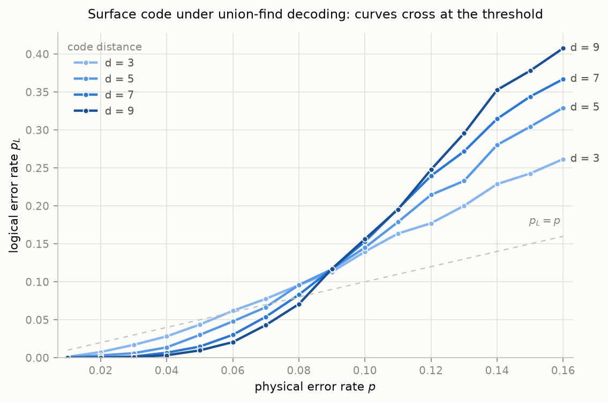

# surface-code

A distance-*d* planar surface code playground in Go: bit-flip noise,
Z-stabilizer syndrome extraction, a near-linear-time **union-find decoder**
(Delfosse–Nickerson style), and a parallel, deterministic Monte Carlo driver
that produces logical-vs-physical error-rate curves exhibiting **threshold
behavior**.

## The physics, in ~200 words

Qubits are fragile: stray noise flips them, and you cannot simply copy a qubit
to back it up. Quantum error correction spreads one *logical* qubit across
many *physical* qubits so that errors can be caught before they matter. The
surface code is the leading practical scheme: data qubits are laid out on a
2D grid, and each *stabilizer* repeatedly measures the parity of its few
neighbors. A flipped qubit lights up the adjacent stabilizers like a tripwire
— without revealing (or disturbing) the encoded information.

The lit stabilizers (the *syndrome*) mark the endpoints of error chains, and
a *decoder* must guess which chains caused them. Small guesses that are wrong
by a closed loop are harmless; a guess that is wrong by a chain spanning the
lattice flips the logical qubit — a *logical error*.

The magic is the **threshold**: if the physical error rate *p* is below a
critical value *p*<sub>th</sub>, making the lattice bigger makes the logical
error rate *smaller* — exponentially so. Above it, bigger is worse. Plotting
logical error rate against *p* for several distances shows all curves
crossing at *p*<sub>th</sub> (≈ 9% for this model and decoder). That crossing
is why quantum computers can scale at all.

## What is simulated (v1 scope)

- **Only bit-flip (X) errors on data qubits**, decoded with Z-stabilizer
  syndromes. X errors and Z checks form a closed classical parity problem, so
  the whole simulation is bits, not amplitudes (the standard pedagogical
  simplification — no stabilizer/Clifford simulation is attempted).
- **Perfect syndrome measurement** — no measurement errors, single round.
- **Standard (unrotated) planar layout**, odd distance d: data qubits on the
  edges of a square grid (d² + (d−1)² of them), Z-stabilizers on vertices
  (d(d−1)), rough boundaries left and right. Every object has an explicit
  `Coord{Row, Col}` on a doubled grid: horizontal qubits at (2r, 2c),
  vertical qubits at (2r+1, 2c+1), Z-stabilizers at (2r, 2c+1).
- **Noise**: iid X-flip on each data qubit with probability p, injectable
  `*rand.Rand` everywhere, so every run is reproducible.
- **Logical check**: a residual operator (error ⊕ correction) is a logical X
  iff it crosses the lattice left-to-right an odd number of times; the
  parity of the residual on the left boundary cut computes exactly that.

## The union-find decoder

Lit stabilizers seed clusters. Every *active* cluster — odd number of
defects, not touching a boundary — grows all frontier edges by half an edge
per round; fully grown edges fuse clusters (union-find with path halving and
union by size). Clusters that reach a boundary become neutral: the boundary
is a valid terminal that can absorb an unpaired defect. The fully grown
edges form an *erasure*, which is then *peeled*: spanning forests rooted at
boundary nodes, pendant defects add their leaf edge to the correction and
hop inward until they annihilate in pairs or exit through a boundary.

This runs in near-linear time in the number of data qubits and corrects
every error of weight ≤ ⌊(d−1)/2⌋.

### Union-find vs. MWPM

Minimum-weight perfect matching (Blossom) pairs lit stabilizers with true
shortest paths, which is more accurate: for this noise model MWPM reaches a
threshold of ≈ 10.3%, weighted-growth union-find ≈ 9.9%, and this
implementation's simpler uniform growth measures ≈ 9% (see below). In
exchange, union-find is dramatically cheaper — almost-linear versus
super-quadratic worst-case matching — which is why it is a leading candidate
for real-time decoding, and why MWPM is deliberately **not** implemented
here (v1 constraint).

## Usage

```sh
go test ./...          # unit tests, includes decoder distance guarantees
go build ./cmd/threshold

# Full sweep: d ∈ {3,5,7,9}, p ∈ [0.01, 0.16], 10,000 trials per point,
# parallel across all CPUs, fully deterministic given -seed.
./threshold -trials 10000 -seed 1 > threshold.csv

# Plot (needs Python 3 + matplotlib):
python3 scripts/plot_threshold.py threshold.csv threshold.png
```

CSV columns: `d,p,logical_error_rate,trials`.

Flags: `-d 3,5,7,9`, `-pmin`, `-pmax`, `-pstep`, `-trials`, `-workers`,
`-seed`, `-v` (per-point progress on stderr).

Determinism: every (d, p) point derives its own seed from the master seed,
and every trial has its own RNG stream — results are bit-identical for any
worker count and any goroutine schedule.

### Sample results (10,000 trials/point, seed 1)

| p | d=3 | d=5 | d=7 | d=9 |
|------|-------|-------|-------|-------|
| 0.03 | 0.017 | 0.006 | 0.002 | 0.001 |
| 0.06 | 0.062 | 0.048 | 0.030 | 0.021 |
| 0.09 | 0.113 | 0.117 | 0.117 | 0.117 |
| 0.12 | 0.177 | 0.215 | 0.240 | 0.248 |

Below p ≈ 0.09 larger distance suppresses logical errors; above it, larger
distance amplifies them; at the crossing all curves meet — the threshold.



## Library API sketch

```go
l, _ := surface.NewLattice(5)                  // distance-5 planar code
errs := l.SampleErrors(0.05, rng)              // iid X-flips
syndrome := l.Syndrome(errs)                   // lit Z-stabilizer IDs
dec := surface.NewUnionFindDecoder(l)          // implements surface.Decoder
correction := dec.Decode(syndrome)
residual := surface.ApplyCorrection(errs, correction)
failed := l.IsLogicalError(residual)           // logical X flipped?
```

## Limitations

- X errors only; Z errors (decoded by the X-stabilizers of the dual lattice)
  are symmetric and therefore omitted; correlated Y errors are out of scope.
- Perfect syndrome measurement, single round. Measurement errors + repeated
  rounds (3D matching graph) are the natural next step.
- Uniform cluster growth rather than Delfosse–Nickerson's
  smallest-cluster-first weighted growth: same correctness guarantee,
  slightly lower threshold (~9% vs ~9.9%).
- No MWPM baseline (by design in v1) — accuracy comparison above is from the
  literature.

## License

MIT
